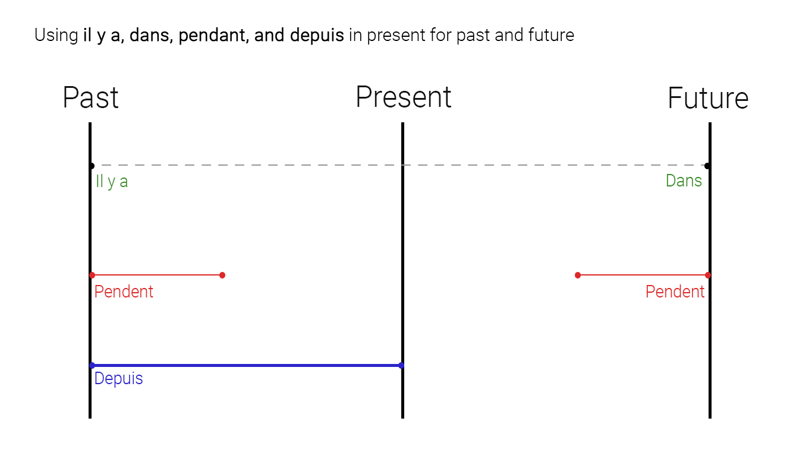

# Passé (Past)

## Passé composé(Perfect (past) tense)

It is a compound past tense, used to express single action which have been completed,  what someone did or what someone has doen/ has been doing or something that has happened or has been happening

The two auxiliary verbs **avoir** and **être** are used with the past participle of a verb to form compound tenses

The regular past participle is formed by taking the stem of the infinitive and adding the following endings


|**-er**|**-ir**|**-re**|
|--|--|--|
|aim(**er**) + **é**|fin(**ir**) + **i**|vend(**re**) + **u**|
|aimé|fini|vendu|

Irregular past participles:

- *Ending with **u***

|Infinitive|Past participles|
|--|--|
|abstenir(to abstain(restain))|abstenu|
|avoir(to have)|eu|
|battre(to beat)|battu|
|boire(to drink)|bu|
|connaître(to know)|connu|
|courir(to run)|couru|
|coudre(to sew)|cousu|
|croire(to believe)|cru|
|décevoir(to deceive; to disappoint)|déçu|
|devoir(to have to)|dû|
|falloir(To need, to have to)|fallu|
|lire(to read)|lu|
|obtenir(to obtain)|obtenu|
|paraître(to appear)|paru|
|plaire(to please)|plu|
|pleuvoir(to rain)|plu|
|pouvoir(to be able to)|pu|
|recevoir(to receive)|reçu|
|savoir(to know)|su|
|(se)taire(to shut up)|tu|
|tenir(to hold)|tenu|
|valoir(to be worth)|valu|
|venir(to come)|vénu|
|vivre(to live)|vécu|
|voir(to see)|vu|
|vouloir(to want)|voulu|


- *Ending with **i***

|Infinitive|Past participles|
|--|--|
|rire(to laugh)|ri|
|suivre(to follow)|suivi|
|dormir(to sleep)|dormi|


- *Ending with **t***

|Infinitive|Past participles|
|--|--|
|atteindre(to attain, to reach, to achieve)|atteint|
|conduire(to drive)|conduit|
|construire(to construct, to build)|construit|
|couvrir(to cover)|couvert|
|craindre(to fear)|craint|
|découvrir(to discover)|découvert|
|dire(to say)|dit|
|écrire(to write)|écrit|
|éteindre(switch off, turn off, to put out)|éteint|
|instruire(to instruct)|instruit|
|faire(to do; to make)|fait|
|joindre(to join)|joint|
|mourir(to die)|mort|
|offrir(to offer)|offert|
|ouvrir(to open)|ouvert|
|peindre(to paint)|peint|
|plaindre(to complain)|plaint|
|Produire(to produce)|produit|
|réduire(to reduce)|réduit|
|souffrir(to suffer)|souffert|


- *Ending with **é***

|Infinitive|Past participles|
|--|--|
|étre(to be)|été|
|envoyer(to send)|envoyé|
|neiger(to snow)|neigé|
|naître(to be born)|né|


- *Ending with **s***

|Infinitive|Past participles|
|--|--|
|acquérir(to acquire)|acquis|
|apprendre(to learn)|appris|
|asseoir(to sit)|assis|
|comprendre(to understand)|compris|
|mettre(to put)|mis|
|permettre(to allow, to permit)|permis|
|prendre(to take)|pris|


### Avoir

The compound tenses of most verbs are formed with avoir
```
-je'ai marqué un but(I scored a goal)
-elle a dansé toute la nuit(she danced all night)
```

### Étre

- all reflexive verbs
    ```
    je me suis baigné(I have a bath)
    ```
- the following verbs (usually of motion)
    **aller**(to go)
    **arriver**(to arrive)
    **descendre**(to go, come down)
    **entrer**(to go, come in)
    **monter**(go up, come up)
    **mourir**(to die)
    **naître**(to be born)
    **partir**(to leave)
    **passer**(to go through, to drop in)
    **rester**(te remain)
    **retourner**(to return)
    **sortir**(to go, come out)
    **tomber**(to fall)
    **venir**(to come)

    and their compounds

    **revenir**(to come back)
    **devenir**(to become)
    **parvenir**(to reach, to manage to)
    **rentrer**(to return)
    **remonter**(to go up again)
    **redescendre**(to go down again)

To remember general verbs use abberivation **DR** & **MRS VANDERTRAMP**

|||
|--|--|
|D|descendre|
|R|rentrer|
|M|monter|
|R|rester|
|S|sortir|
|V|venir|
|A|aller|
|N|naître|
|D|devenir|
|E|entrer|
|R|revenir|
|T|tomber|
|R|retourner|
|A|arriver|
|M|mourir|
|P|partir|

But: **prévenir**(to warn) and **subvenir**(to provide for) take a direct object and are conjugated with **avoir**

*Note: **passer** can also be conjuagted with **avoir***
```
-il a passé par Paris(he went via Paris)
```

### (Transitifs et intransitifs)Transitive and intransitive verbs 
Some of the verbs listed above (used with **être**) can take a direct object. In such cases they are conjugated with **avoir** and can have different meaning these verbs are called **transitifs(transitive) verbs**(with a direct object)

**descendre**               to take/bring down, to go down(the stairs, a slope)          
**monter**                  to take/bring up, to go up(the stairs, a slope)
**rentrer**                 to take/bring/put in
**retourner**               to turn over
**sortir**                  to take/bring out

*Note: objects which comes after a verb are known as **direct object**. Objects which comes after a preposition are known as **indirect object**.*

|Verb|Transitif(avoir)|Intransitif(être)|
|--|--|--|
|montre|j'**ai** monté la valise<br/>(I assembled the suitcase)|je **suis** monté **sur** la moto<br/>(I got on the motorbike)|
||le garçon **a** monté les bouteilles de vin de la cave<br/>(the waiter brought the bottles of wine up from the cave/celler)|les prisonniers **sont** montés sur le toit<br/>(the prisoners climbed on the roof)|
|desendre|elle **a** descendu l'escalier<br/>(she went down the stairs)|elle **est** descendue par l'escalier(She came down the stairs)|
||elle **a** descendu un vieux tableau de l'atelier<br/>(she brought an old painting sown from the loft)||
||elle **a** descendu l'escalier<br/>(she came down the stairs)||
|sortir|ils **ont** sorti les livres<br/>(they took out the books)|ils **sont** sortis **par** la fenêtre<br/>(they went out the window)|
||les élèves **ont** sorti leurs livres<br/>(the pupils took out their books)|les élèves **sont** sortis **à** midi<br/>(the pupils came out at midday)|
||le gangster **a** sorti un revolver<br/>(the gangster pulled out a revolver)|ils **sont** sortis **de la** piscine<br/>(they got out of the swimming pool)|
|retourner|il **a** retourné(he returned)|il **est** retourné **chez** Paul<br/>(he went back to the house of Paul)|
|rentrer|j'**ai** rentré les vêtements(I took the clothes)|je **suis** rentré **dans** la chambre<br/>(I went into the room)|
||j'**ai** rentré la voiture dans le garage<br/>(I put the car in the garage)|nous **sommes** rentrés tard **à la** maison<br/>(we returned home late)|
|passer|elle **a** passé le thé à Barbara<br/>(she passed the tea to Barbara)|elle **est** passée **par** sa maison<br/>(she passed by her house)|


## Past historic (passé simple)

Used in the same way as the perfect tense, to describe a single, completed action in the past (what someone did or something that happened). It is a literary tense, not common in everyday spoken. It is found mainly as a narrative tense in written form or in storytelling, for completed actions in the past or in speaking of the dead.


**stem of the infinitive** + the following endings:

|Ending|**je**|**tu**|**il/elle/on**|**nous**|**vous**|**ils/elles**|
|--|--|--|--|--|--|--|
|-er|-ai|-as|-a|-âmes|-âtes|-èrent|
|-ir|-is|-is|-it|-îmes|-îtes|-irent|
|-re|-is|-is|-it|-îmes|-îtes|-irent|

Irregular avoir and être verbs

|Verb|**je**|**tu**|**il/elle/on**|**nous**|**vous**|**ils/elles**|
|--|--|--|--|--|--|--|
|avoir|eus|eus|eut|eûmes|eûtes|eurent|
|être|fus|fus|fut|fûmes|fûtes|furent|


Example

|Aimer(to like)|Finir(to finish)|Vendre(to sell)|
|--|--|--|
|j'aimai|je finis|je vendis|
|tu aimas|tu finis|tu vendis|
|il/elle aima|il/elle finit|il/elle vendit|
|nous aimâmes|nous finissîmes|nous vendîmes|
|vous aimâtes|vous finissîtes|vous vendîtes|
|ils/elles aimèrent|ils/elles finirent|ils/elles vendirent|

```
-le piéton ne vit pas arrive la voiture(the pedestrian didn't see the car coming)
```

## Passé antérieur (Past anterior)

This tense is used instead of hte pluperfect to express an action that preceded another action in the past (ie a past in the past). It os usually introduced by a conjuction of time (trnaslated by 'when', 'as soon as', 'after' etc) and the main verb is in the past historic.

Formed by the auxiliary conjugated in the past historic + past participle of the verb.

<table><colgroup><col><col><col></colgroup>
<thead>
<tr>
<th colspan="2"><i>avoir</i></th>
<th colspan="2"><i>être</i></th>
</tr>
</thead>
<tbody>
<tr>
<td>j’eus</td>
<td class="center middle" rowspan="6">
<p>aimé</p>
<p>fini</p>
<p>vendu</p>
</td>
<td>je fus</td>
<td class="center middle" rowspan="6">
<p>parti</p>
<p>partie</p>
<p>partis</p>
<p>parties</p>
</td>
</tr>
<tr>
<td>tu eus</td>
<td>tu fus</td>
</tr>
<tr>
<td>il/elle/on eut</td>
<td>il/elle/on fut</td>
</tr>
<tr>
<td>nous eûmes</td>
<td>nous fûmes</td>
</tr>
<tr>
<td>vous eûtes</td>
<td>vous fûtes</td>
</tr>
<tr>
<td>ils/elles eurent</td>
<td>ils/elles furent</td>
</tr>
</tbody>
</table>

```
-il se coucha dés qu'il furent partis(he went to bed as soon as they had left)
-à peine eut-elle raccroché que le téléphone sonna(she'd hardly hung up when the telephone rang)
```


## Use of depuis with tenses (for, since)

- The present is used to discribe the actions which started in the pst and have continued until the present
    ```
    -il habite ici depuis trois ans(he is been living here for three years)
    -elle l'attend depuis ce matin(she is been waiting for himm since this morning)
    ```

    But: The perfect(passé composé) is used when the clause is negative or when the action has been completed
    ```
    -il n'a pas pris de vacances depuis longtemps(he has not taken any holidays for a long time)
    -j'ai fini depuis un bon moment(I have been finished for quite a while)
    ```

Note: 
- **il y a....que** or **voilà....que** are also used with the present tense to translate 'for'
    ```
    it is been ringing for ten minutes
    -ça sonne depuis dix minutes
    -il y a dix minutes que ça sonne
    -voilà dix minutes que ça sonne
    ```
- **depuis que** is used when 'since' introduces a clause, ie when there is a verb following **depuis**

    ```
    -elle dort depuis que vous êtes partis(she's been sleeping since you left)
    ```
- depuis (foe, since) and  pendant(for, during) : depuis refers to the starting point of an action which is still going on and pendant refers to the duration of action which is over and is used with the perfect
```
-il vit ici depuis deux mois(he is been living here for two months)
-il a vécu ici pendant deux mois(he lived here for two months)
```


*Note: **depuis** refers to the startng piont of an action whcih is still going on and **pendant** refers to the duration of the an action which is over; **pendant** is used with the plusperfect[Plus-que-parfait (Pluperfect)](chapter_8.6_verbsPlusqueperfait.md)*

## Passé recent (Recent past)
If it describe something that has just happened, just took place, it is used in the present.

**venir de** + infinitive means 'to have just done'

|Verb|**je**|**tu**|**il/elle/on**|**nous**|**vous**|**ils/elles**|
|--|--|--|--|--|--|--|
|venir|viens|viens|vient|venons|venez|viennent|


```
-l'avion vient d'arriver(the plane has just arrived)
-je viens de te le dire!(I have just told you!)
-il vient de partir(he just left)
-je viens de manger(I just ate)
-elle vienent d'etudier(she just studied)
```