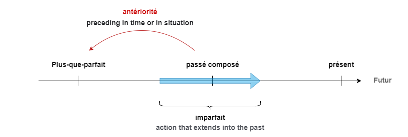

# Plus-que-parfait (Pluperfect)

Used to express an action that took place before another which has already taken place in the past. To express past of the past (passé du passé)



**avoir** or **être** of imperfect(imparfait) + past participle

|Verb|**j'**|**tu**|**il/elle/on**|**nous**|**vous**|**ils/elles**|
|--|--|--|--|--|--|--|
|être|étais|étais|était|étions|étiez|étaient|
|avoir|avais|avais|avait|avions|aviez|avaient|

```
-je n'étais jamais allé(I never went)
-j'avais aussi travaillé(I had also worked)
-il n'avait pas encore développé(he had not yet developed)
-il n'avait pas voulu aller avec eux(he had not wanted to go with them)
-elle était essoufflée parce qu'elle avait couru(she was out of breath because she had been running)
```

*Note: for the conjugation it follwos the same rule as passé composé(perfect past) **avoir/être***

||avoir|être|
|--|--|--|
|je/j'|aurai parlé|étais allé(e)|
|tu|avais parlé|étais allé(e)|
|il/elle/on|avait parlé|était allé(e)|
|nous|avions parlé|étions allé(e)s|
|vous|aviez parlé|étiez allé(e)(s)|
|ils/elles|avient parlé|étaient allé(e)s|

- to describe an action which had started in the past and was completed or negative sentence for starting action in past and continuing(using **depuis**(since, for))
        -je n'étais pas allé au théâtre depuis des années(I had not been to the theather for years)
        -il était parti depuis peu(he had recently left/he had been gone for a short time)